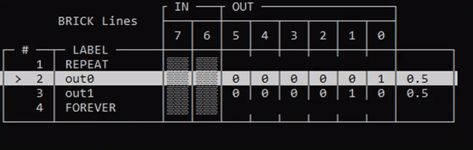
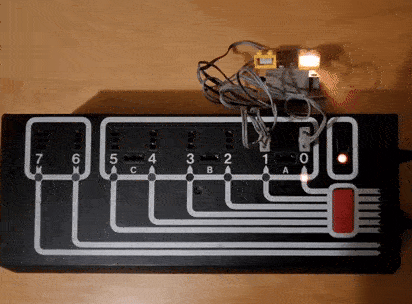

# BRICK Lines

BRICK Lines is an open-source clone of the LEGO® Lines software from the mid/late 1980s. The idea is to interact with early LEGO® programmable systems (control systems, robotics) from the 4.5V era through a LEGO® Technic Interface A "brick" (70288 resp. 70455). LEGO® Lines was originally used with 8-bit machines, e.g. the Apple ][, the Commodore C64, the BBC Micro and the IBM PC running DOS.

This software clone is made for a modern era computer and should run on any Windows, Linux and macOS machine with a Python3 environment.

The idea is that the old materials (both the bricks and the teaching resources) from the 1980s can be brought back into life today! It can help teach people programming, practice problem-solving skills and get into the fantastic world of embedded systems.

## Prerequisites

* A Python 3 environment
* Python dependencies:
  * package `pyserial` for serial communication
  * package `colorama` so that terminal output can be highlighted
* If you want to _run_ Lines programs (and not only print them):
  * LEGO® Interface A
  * Arduino Nano acting as virtual COM port (using USB CDC) which translates between serial communication (PC) and parallel communication (Interface A); see also: [./hardware/serial2parallel_converter/README.md](./hardware/serial2parallel_converter/README.md)
  * wires and 4.5V peripherals

Need help? Feel free to comment in the Eurobricks forum thread [LEGO Interface A (9750/9771) – LEGO Technic Control 1 (TC1) reference/ideas thread](https://www.eurobricks.com/forum/index.php?/forums/topic/192941-lego-interface-a-97509771-%E2%80%93-lego-technic-control-1-tc1-referenceideas-thread) or contact the author here on GitHub or mastodon ([@maehw@chaos.social](https://chaos.social/@maehw)).

## Usage

BRICK Lines can be used as a standalone command line tool or as a Python module with scripted instructions.

### ... as standalone command line tool

Display command line tool usage by adding option `--help`:

```commandline
> python3 brick_lines.py --help
usage: brick_lines.py [-h] -f FILE [-s SERIAL_PORT]

BRICK Lines

options:
  -h, --help            show this help message and exit
  -f FILE, --file FILE  Input file name
  -s SERIAL_PORT, --serial-port SERIAL_PORT
                        Name of serial device to Interface A; required to run a program on
```

The long and the short names can be used interchangeably, e.g. `--file` (long name, two dashes) is the same as `-f` (short name, one dash).

A program from a save file can be printed without running it when leaving out the `--serial-port` argument but providing the `--file` argument:

```commandline
> python3 brick_lines.py -f ./examples/apple/EGC.txt
                      ┌ IN ───┬ OUT ──────────────────┐
        BRICK Lines   ├───┬───┼───┬───┬───┬───┬───┬───┤
                      │ 7 │ 6 │ 5 │ 4 │ 3 │ 2 │ 1 │ 0 │
┌─ # ──┬─ LABEL ──────┼───┼───┼───┼───┼───┼───┼───┼───┼───────┐
│    1 │ light        │▒▒▒│▒▒▒│ 0 │ 1 │ 0 │ 0 │ 0 │ 0 │       │
│    2 │ oneway       │▒▒▒│▒▒▒│ 0 │ 0 │ 0 │ 0 │ 0 │ 1 │ 3     │
│    3 │ light        │▒▒▒│▒▒▒│ 0 │ 1 │ 0 │ 0 │ 0 │ 0 │       │
│    4 │ otherway     │▒▒▒│▒▒▒│ 0 │ 0 │ 0 │ 0 │ 1 │ 0 │ 2     │
│    5 │ light        │▒▒▒│▒▒▒│ 0 │ 1 │ 0 │ 0 │ 0 │ 0 │       │
│    6 │ oneway       │▒▒▒│▒▒▒│ 0 │ 0 │ 0 │ 0 │ 0 │ 1 │ 2     │
│    7 │ light        │▒▒▒│▒▒▒│ 0 │ 1 │ 0 │ 0 │ 0 │ 0 │       │
│    8 │ otherway     │▒▒▒│▒▒▒│ 0 │ 0 │ 0 │ 0 │ 1 │ 0 │ 2     │
└──────┴──────────────┴───┴───┴───┴───┴───┴───┴───┴───┴───────┘
```

To execute a program, provide the file name (`--file`) and the serial port name (`--serial-port`)

```commandline
> python3 brick_lines.py -f ./examples/apple/EGC.txt -s COM4
                      ┌ IN ───┬ OUT ──────────────────┐
        BRICK Lines   ├───┬───┼───┬───┬───┬───┬───┬───┤
                      │ 7 │ 6 │ 5 │ 4 │ 3 │ 2 │ 1 │ 0 │
┌─ # ──┬─ LABEL ──────┼───┼───┼───┼───┼───┼───┼───┼───┼───────┐
│    1 │ light        │▒▒▒│▒▒▒│ 0 │ 1 │ 0 │ 0 │ 0 │ 0 │       │
│ >  2 │ oneway       │▒▒▒│▒▒▒│ 0 │ 0 │ 0 │ 0 │ 0 │ 1 │ 3     │
│    3 │ light        │▒▒▒│▒▒▒│ 0 │ 1 │ 0 │ 0 │ 0 │ 0 │       │
│    4 │ otherway     │▒▒▒│▒▒▒│ 0 │ 0 │ 0 │ 0 │ 1 │ 0 │ 2     │
│    5 │ light        │▒▒▒│▒▒▒│ 0 │ 1 │ 0 │ 0 │ 0 │ 0 │       │
│    6 │ oneway       │▒▒▒│▒▒▒│ 0 │ 0 │ 0 │ 0 │ 0 │ 1 │ 2     │
│    7 │ light        │▒▒▒│▒▒▒│ 0 │ 1 │ 0 │ 0 │ 0 │ 0 │       │
│    8 │ otherway     │▒▒▒│▒▒▒│ 0 │ 0 │ 0 │ 0 │ 1 │ 0 │ 2     │
└──────┴──────────────┴───┴───┴───┴───┴───┴───┴───┴───┴───────┘
```

The currently executed line is highlighted and marked with an `>` next to the line number.

There are a number of save files from Commodore and Apple ][ machines in the `./examples` subdirectory of this git repository!

### ... as a Python module

Instead of loading old save files, we can write a BRICK Lines program from scratch using Python.

A very minimalistic example is `blinky.py`:

```python
from brick_lines import *

p = BrickLines()
p.append(BrickInstructionRepeat())
p.append(BrickInstructionSetOutput("out0", 0x01, 0.5))
p.append(BrickInstructionSetOutput("out1", 0x02, 0.5))
p.append(BrickInstructionForever())
p.connect("COM4")
p.run()
```

The basic idea is to create a `BrickLines` object which represents a BRICK Lines program. Then, add instructions by calling the `append()` method with instances of `BrickInstruction*` classes as arguments. Finally, call `print()` or `connect()` and `run()` to execute the program!

This is what the blinky Lines program (embedded into Python) looks like when being executed from the command line:



And in real world:



## Background info

"Lines is designed to be an introduction to building a control program. Control is effected by supplying or denying power to a set of connections on the interface usually switching motors on and off. (...) Lines is a controller which treats a series of instructions as a control program which it can use to control a LEGO® model through the LEGO® Interface."

_(from: LEGO® Lines User Guide, page 1.16)_

Besides motors, lamps ("light bricks") can be used as outputs. For inputs there are opto-sensors and touch sensors available!


"An instruction line has the following structure:
`label` + `bit pattern` + `value`"

_(from: LEGO® Lines User Guide, page 1.16)_

This is also matches how the Lines screen is divided into different areas.

The following labels are reserved and interpreted as keywords: `REPEAT`, `UNTIL`, `FOREVER`, `ENDREPEAT`, `IF`, `ENDIF` and `COUNT`

This allows to build the following control structures:

* `REPEAT <number>` .. `ENDREPEAT`: counting loops
* `REPEAT` .. `UNTIL <condition>`: conditional loops (check input(s))
* `REPEAT` .. `FOREVER`: endless loops
* `IF <condition>` .. `ENDIF`: condition structure (check input(s))
* `COUNT <condition>`: wait for a number of changes on an input

## TODOs and ideas

* Add an interactive mode for entering data to edit programs on the fly and also create totally new programs from scratch
* In the interactive mode add the capability to "test" a BRICK Line (i.e. to apply the output bit pattern directly)
* Add support for storing to save files in the different formats
* Add support for printing a Lines program in the same format as LEGO® Lines did
* Add support for the save files of the IBM PC/DOS
* Improve redrawing as currently the whole screen is redrawn and this can take up quite some time
* Clarify original LEGO® Lines' behaviour:
  * Find out what the default waiting time is (when no value has been provided) after setting the outputs before continuing execution in the next line
  * Find out whether the last output value "sticks" after the program terminates or all outputs are turned off

## Contributing

Yes, contributions are very welcome. Feel free to open a merge/pull request or open an issue to address problems, ideas or changes to the code! It'd also be nice to hear something from those users who got in touch with the original LEGO® Lines software back in the 1980s or nowadays.

## Disclaimer

LEGO® is a trademark of the LEGO Group of companies which does not sponsor, authorize or endorse this project.
